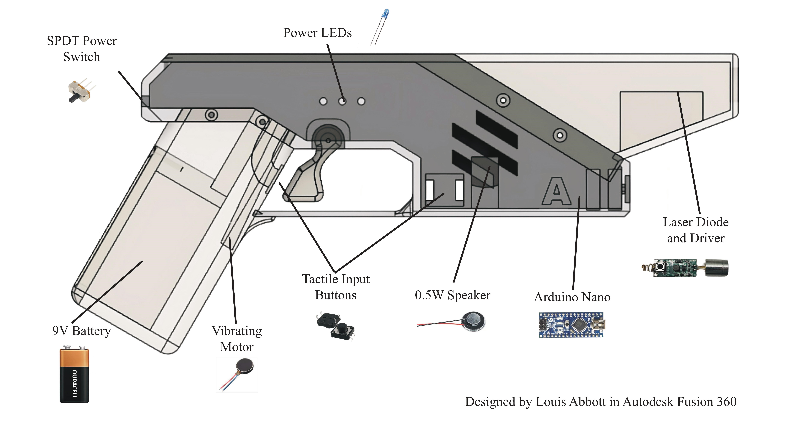
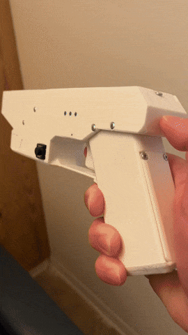
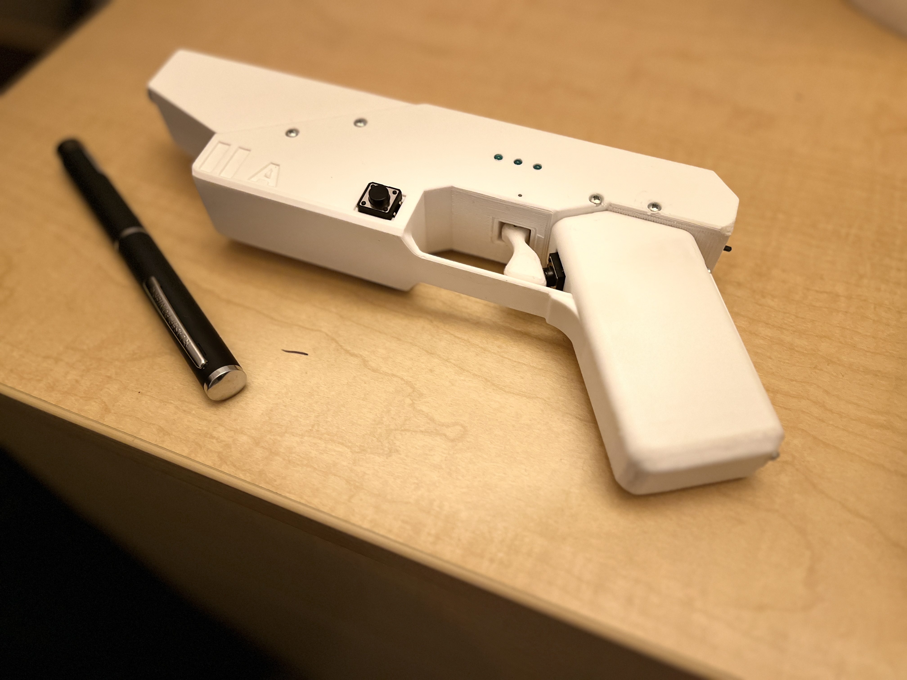
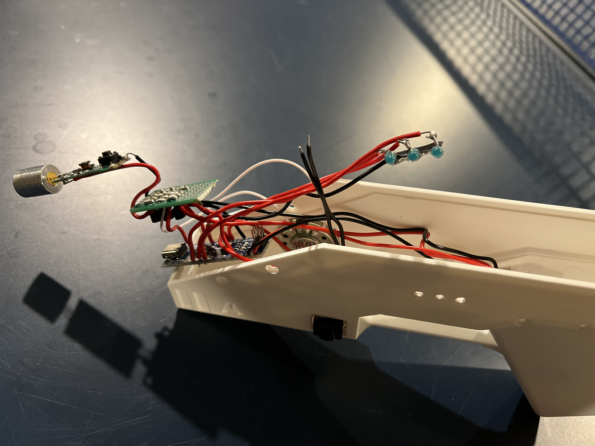
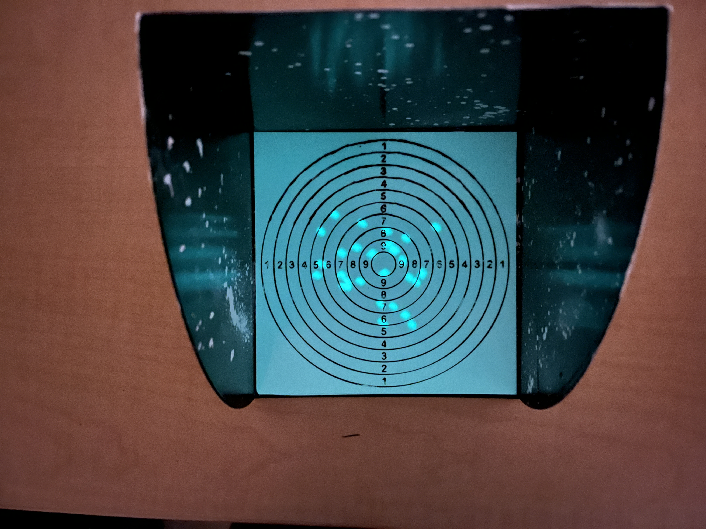
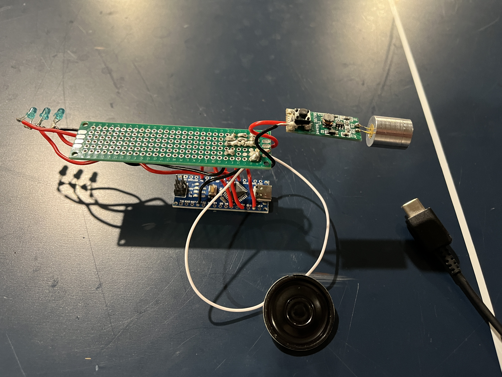
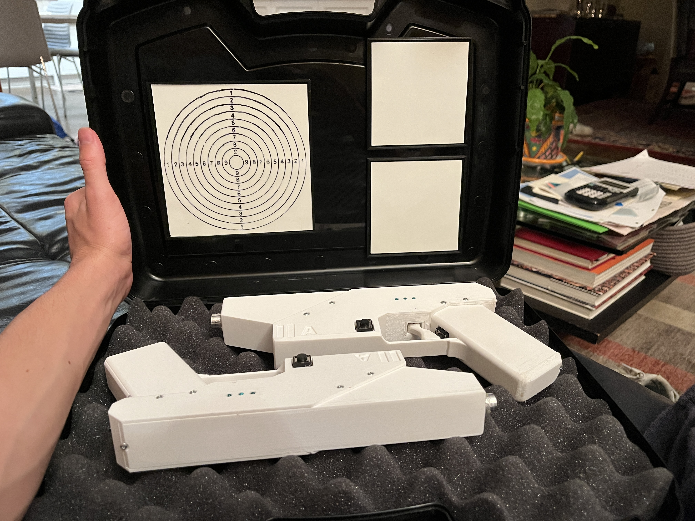

# GlowBlaster
### A unique and customizable Star Wars-inspired blaster toy with audio, visual, and haptic feedback.

  
  <!--  -->

The blaster uses an Arduino Nano microcontroller board to pulse a 405 nm laser, imprinting green dots on phosphorescent (glow-in-the-dark) targets. The casing is 3D printed PLA designed to resemble a Mandalorian blaster from The Clone Wars. Anything that is glow-in-the-dark works as a target. There are 5 firing modes, plus an option to enable reloading functionality. Overall, the build cost for this project is very inexpensive but will depend on your access to different materials.

See <i>build_instructions.pdf</i> for more info and instructions on how to build this yourself. Have fun with the best Star Wars toy money can't buy!

## Demo Video
https://youtu.be/vtG4vrYUyLA

## Gallery

  
  
  
  
  
  
  

